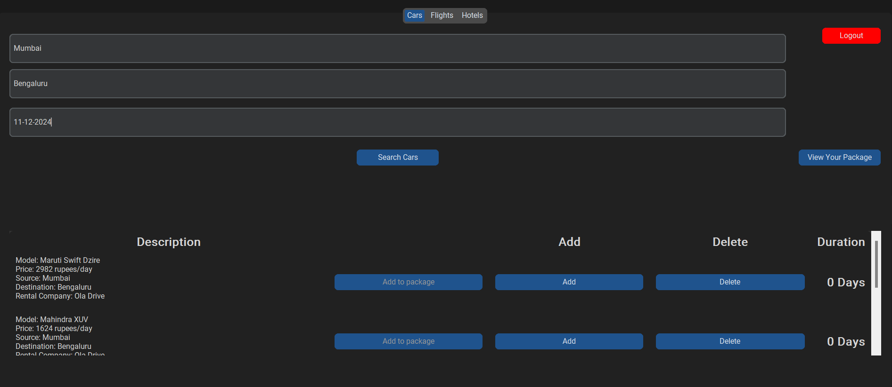
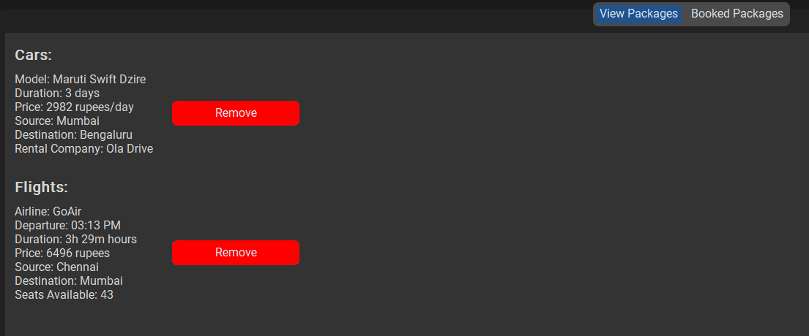
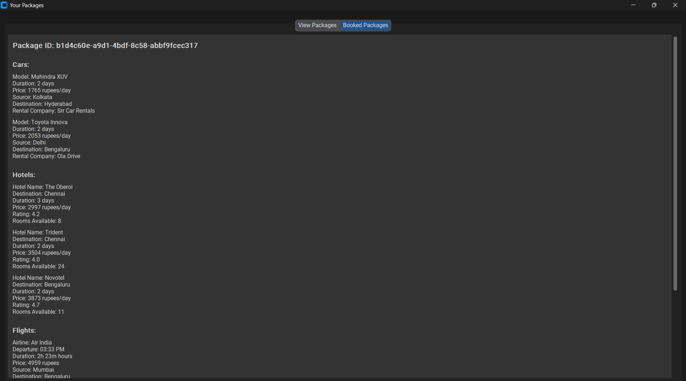

# Travel Booking System
This app is a travel booking system that allows users to search for and book flights, hotels and rental cars. This app is written using Python.

## How to use the app
**Step 1:** Open the main.py file and click on the "Run" button if you are on VS code. If you are using terminal, navigate to the "Python_Project_Team_1-main" directory and type "python main.py"

**Step 2:** Create an account by clicking on the "Register" button.

**Step 3:** Enter the same credentials in the login page that you used while registering and click on the "Login" button.

* Users can search for specific cars, add or delete the number of days required for renting, and then click on add to package which will be confirmed by a popup. 
* Users can proceed to add another car if required or switch to the hotels/flights tab and also book their flights and hotels under the same package.
* Once everything is done, users can click on the "view your package" button to review their packages and remove any specific car/hotel/flight if needed. 
* Once the user is happy with their package, they can click on the "Book this Package" button and their package is saved with a Unique Package ID which they can view under the "Booked Packages" tab.
* Users can go back to the main window to book another package if needed, and can book the new package with a different Package ID without any hassle.
    
PS: At any time you can press the "logout" button to exit the app.

## List of supported Operating Systems
* Windows
* Mac OS
* Linux

## Requirements
* Python, pymongo, CustomTkinter and Tkinter should be installed on your machine.
* To install CustomTkinter or Tkinter, in your terminal window type "pip install customtkinter", "pip install tk" and "pip install pymongo".

## Features Implemented
**1. Search Functionality:** Users can enter a source city, destination city and travel date if they want to and then use the search button to find cars/flights/hotels specific to their search.

**2. Availability:** For cars, if one user has already booked a specific car, then it won't show up for another user when he presses the "Search Cars" button. However for hotels and flights, if a specific number of rooms or seats are filled up, then those hotels/flights wont be available anymore and won't even appear in the search page for another user.

**3. Easy Booking:** Users can easily bundle multiple cars/flights/hotels under the same package and review them before finally booking it. If needed, users can also book multiple packages which can be easily identified using its Unique Package ID.

**4. The Users data and Packages are saved on the cloud:** With the use of pymongo database, the users login credentials and their packages booked are automatically saved on the cloud, so users don't need to worry if they lose their machine as long as they have clicked on the final "Book this Package" buttton. All they need to do is login with the same credentials next time.

**5. Booking/Transaction Report:** Users can click on the "View your Package" button, switch to the "Booked Packages" tab and can easily access their past Bookings/Transactions.

## Libraries/ Databases used
1. CustomTkinter
2. Tkinter
3. PIL
4. UUID
5. Pymongo Database

## In-Built Modules used
**1. Sys and OS:** They are used to add the parent directory to the system path so that other modules can be imported.

**2. CustomTkinter:** Provides the graphical components used in the application and was used for the overall GUI of the application.

**3. Tkinter.ttk:** It helped us use themed widgets like Treeview and scrollbar in our GUI.

**3. Pymongo:** It helps us to connect to the MongoDB database and also interacts with the users and packages collections.

**4. PIL:** Used for opening and resizing the logo image and to convert it to a format compatible with CustomTkinter.

**5. uuid:** It was used to generate Unique Package ID's.

## Modules created
**1. Windows.RegisterWindow:** It imports the RegisterWindow class, that is used for handling the user registration.

**2. Classes.CarManager:** It imports the CarManager class, that is used to manage cars available, addition and viewing from a manager point of view.

**3. Windows.MainWindow:** It imports the MainWindow class, which leads to the main application window after the user succesfully logs in.

**4. Classes.UserManager:** It imports the UserManager class, that is used to create a new user object during registration.

## Classes created
**1. Travel Manager:** This is the base class that manages general travel-related information such as a unique identifier, price, duration, and destination. It tracks availability with a default value of True. The get_details method returns the key details of the travel like its ID, availability, price, duration, and destination. Most other classes inherit attributes and methods from this class.

**2. Car Manager:** It inherits from the Travel Manager class, adds attributes and methods related to car rentals.  It provides a mechanism to manage details about a car rental, including specific details like the car model, source, and rental company.

**3. Hotel Manager:** This class extends the Travel Manager class and incorporates attributes and methods related to hotel stays. It facilitates the management of hotel information, such as the hotel name, its rating, and the availability of rooms.

**4. Flight Manager:**  It extends the functionality of the Travel Manager class by incorporating attributes and methods specific to flight reservations. It enables managing flight details, including the airline, departure location, departure time, and seat availability.

**5. Package Manager:** This class manages a travel package, identified by a unique package ID. It organizes the package into three categories: cars, hotels, and flights, with each category holding a list of relevant items.

**6. User Manager:** This class handles user information, including a unique username and password. It also manages a list of packages associated with the user.

**7. App:** It displays a login form with username, password fields and a "Login" button for an already existing user. It also provides a "Register" button to create a new user.

**8. Register Window:** It is the registration window where users can create new accounts with a unique username and password.

**9. Main Window:** It is the central window for the user' operations, that allows the user to search, navigate between tabs (Cars, Flights, Hotels) and also book packages.

**10. View Package Window:** It allows the user to view the packages that they have added and finally book the entire package as a whole.

## Group Members
**1. A Sri Avneesh:** Worked on populating the individual tabs when we click on search cars, hotels or flights. He also created the Register window.

**2. Kamalnath A:** Worked on the view package window and created the logout button.

**3. Parikshith Aithal K V:** Worked on the backend including implementation of the classes and inheritance.

**4. Saharsh S Hiremath:** Worked on the login page and the README.md file and created the view package button.

**5. Rihan Sourabh Doshi:** Worked on the main window file and created the backend including database to store the data and packages.
